# DAD-project
- [Introducción al funcionamiento de la aplicación](#introducción-al-funcionamiento-de-la-aplicación)
  * [Casos de uso](#casos-de-uso)
  * [Parte pública y privada de la aplicación](#parte-pública-y-privada-de-la-aplicación)
  * [Diagrama de navegación](#diagrama-de-navegación)
  * [Descripción general de las entidades](#descripción-general-de-las-entidades)
    + [Oferta](#oferta)
    + [Usuario](#usuario)
    + [Valoracion](#valoración)
    + [Lista](#lista)
  * [Descripción del servicio interno](#descripción-del-servicio-interno)
- [Diagramas del modelo de datos](#diagramas-del-modelo-de-datos)
- [Navegación](#navegación)

<small><i><a href='http://ecotrust-canada.github.io/markdown-toc/'>Table of contents generated with markdown-toc</a></i></small>

# Introducción al funcionamiento de la aplicación
Los usuarios de SellHub pueden _crear_ ofertas y _comprar_ ofertas ya creadas. Cuando compran una oferta, deben valorar al vendedor dejando una puntuación y un comentario. Los usuarios también pueden cerrar o modificar sus ofertas, crear listas donde guardar organizadamente ofertas que les interesen, o utilizar los buscadores de ofertas/usuarios para encontrar lo que buscan.

## Casos de uso
Casos de uso por actor:

Todos los _Usuarios_ (en general, independientemente de si son usuarios registrados o anónimos) podrán:
- **Consultar ofertas** (utilizando el buscador de ofertas)
- **Consultar usuarios** (utilizando el buscador de usuarios)

Los _Usuarios registrados_ (los usuarios que han iniciado sesión) además podrán:
- **Crear ofertas**
- **Eliminar ofertas** (consultándolas previamente)
- **Comprar ofertas** (consultándolas previamente)

Los _Usuarios anónimos_ (los usuarios que no han iniciado sesión) además podrán:
- **Iniciar sesión**
- **Crear una cuenta de usuario**

## Diagrama de navegación

## Parte pública y privada de la aplicación
Los usuarios no registrados de la aplicación podrán:
- Consultar las ofertas (y filtrarlas).
- Ver perfiles de cuentas, donde podrán consultar la puntuación de vendedor y los comentarios de una cuenta.
- Crear una cuenta de usuario (registrarse).

Los usuarios registrados tendrán a su disposición toda la funcionalidad de la aplicación, pudiendo:
- Consultar ofertas y perfiles (igual que un usuario no registrado).
- Crear ofertas.
- _Comprar_ ofertas.
- Administrar su cuenta, por ejemplo cambiando la contraseña.

## Descripción general de las entidades
### Oferta
Representa una oferta de venta que ha creado un usuario. Las ofertas pueden consultarse y filtrarse en un buscador que ofrece la aplicación tanto por usuarios registrados como anónimos, pero sólo pueden crearlas los usuarios registrados.
#### Propiedades
- **Vendedor**: El usuario que ha creado la oferta
- **Precio**: El precio de venta establecido por el vendedor en el momento de la creación de la oferta.
- **Título**: Breve descripción de lo que se está vendiendo.
- **Categoría**: Un identificador de texto que clasifica lo que se está vendiendo. Pertenece a un conjunto de categorías predefinido.
- **Fecha (de creación)**: La fecha en la que el vendedor creó la oferta.
- **Fecha (de cierre)**: La fecha en la que al oferta fue comprada por un usuario o cerrada por su creador.

### Usuario
Representa la cuenta de un usuario registrado.
#### Propiedades
- **Nombre**: Un texto corto que identifica el usuario. Es único para cada usuario.
- **Contraseña**: se utiliza para autenticar al usuario en el login.
- **Puntuacion**: La puntuación de vendedor, derivada a partir de las valoraciones de los compradores de sus ofertas.
- **Valoraciones**: Las valoraciones recibidas por compradores de las ofertas que ha creado el usuario.

### Valoración
Representa una valoración sobre un vendedor que ha dejado un usuario tras comprar una oferta que el vendedor ha creado.
#### Propiedades
- **Autor**: El usuario que ha escrito el comentario.
- **Puntuación**: Puntuación numérica que se le da al vendedor de la oferta.
- **Comentario**: Un pequeño texto que acompaña a la puntuación.
- **Fecha**: La fecha de publicación de la valoración. Se establece automáticamente.

### Lista
Representa una lista que ha creado un usuario para organizar las ofertas que le interesan.
#### Propiedades
- **Nombre**: El nombre de la lista. Un usuario no puede tener dos listas del mismo nombre.
- **Propietario**: Usuario que ha creado y administra la lista.
- **Contenido**: Las ofertas almacenadas en la lista.

## Diagramas del modelo de datos
### Diagrama de clases
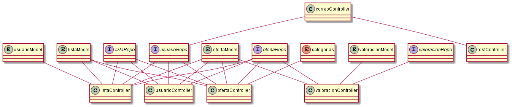
### Diagrama Entidad-Relación
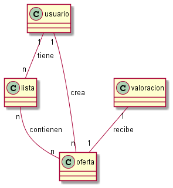

## Descripción del servicio interno
La aplicación utilizará un servicio interno (no accesible de forma directa por los usuarios) de correo/mensajería para facilitar la comunicación entre compradores o entre comprador y vendedor. Utilizando este servicio, los usuarios podrán enviar mensajes de correo electrónico a otros usuarios.

# Navegación

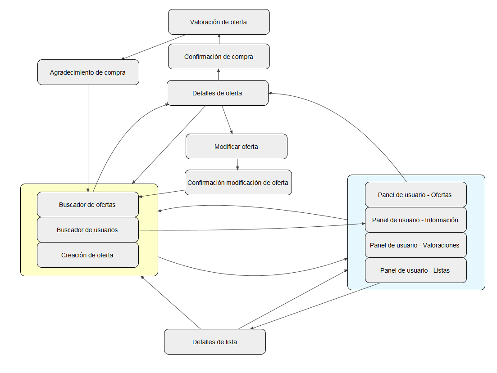

A continuación se muestran capturas de pantalla de cada página y se indica su función en una breve descripción de la misma.

| Captura de pantalla  | Descripción breve |
| ------------- | ------------- |
| 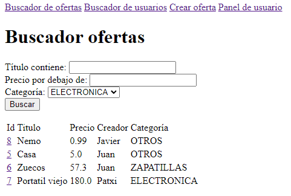  | **Pantalla de buscador de ofertas**: Aquí se pueden consultar y filtrar las ofertas activas en SellHub en un momento dado.  |
| 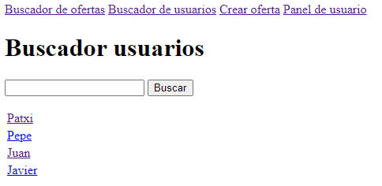 | **Pantalla de buscador de usuarios**: Aquí se pueden consultar los usuarios de SellHub.  |
| 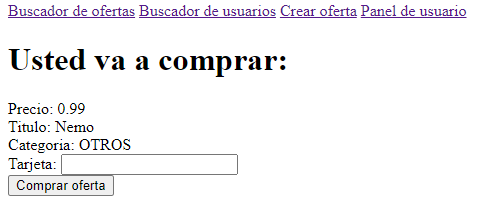 | **Pantalla de confirmación de compra**: Desde esta pantalla puede comprarse una oferta.  |
| 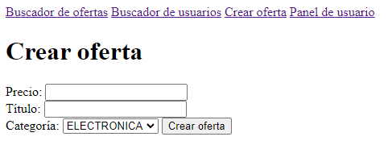 | **Pantalla de creación de oferta**: Desde aquí los usuarios pueden crear ofertas.  |
| 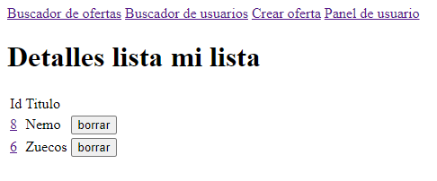 | **Pantalla de detalles de lista**: Aquí se pueden consultar los detalles (principalmente, los elementos) de las listas de un usuario.  |
| 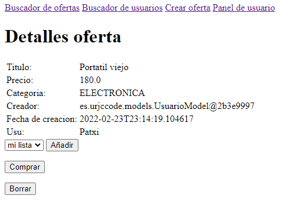 | **Pantalla de detalles de oferta**: Aquí se pueden consultar los detalles de una oferta y realizar operaciones como comprarla o borrarla.  |
| 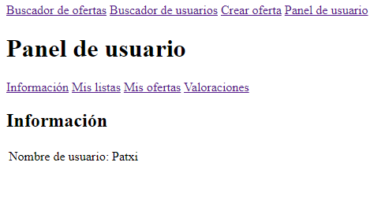 | **Panel de usuario - Información**: Aquí se puede consultar información de un usuario.  |
| 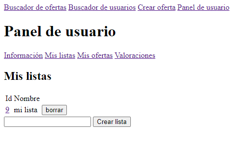 | **Panel de usuario - listas**: Aquí un usuario puede consultar sus listas.  |
| 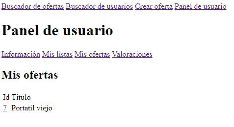 | **Panel de usuario - ofertas**: Aquí un usuario puede consultar sus ofertas.   |
| 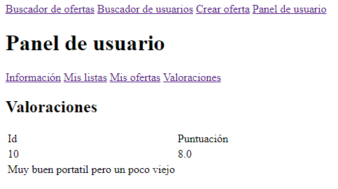 | **Panel de usuario - valoraciones**: Aquí se pueden consultar las valoraciones que ha recibido un usuario.   |
| 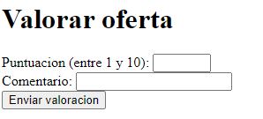 | **Pantalla de valoración de oferta**: Aquí el usuario debe valorar la oferta que acaba de comprar.   |
| 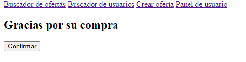 | **Pantalla de agradecimiento de compra**: Aquí se le agradece al usuario la compra realizada en SellHub. |
| 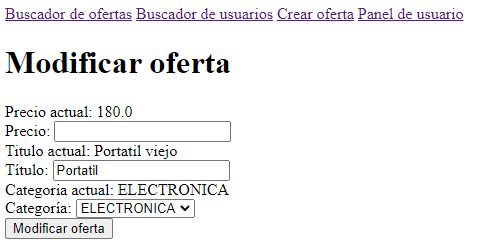 | **Pantalla de modificación de oferta**: Desde aquí se puede modificar una oferta. |
| 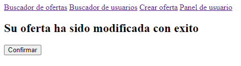 | **Pantalla de confirmación de modifiación de oferta**: Le indica al usuario que su modificación se ha realizado correctamente. |
| 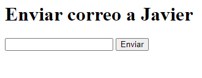 | **Pantalla de envío de mensaje**: Permite al usuario escribir y enviar un mensaje a otro usuario. |

# Instalación en VM

Primero crearemos la máquina virtual, en nuestro caso será una ubuntu en virtual box.
A continuación ejecutaremos el comando: sudo apt install openjdk-16-jre-headless.
Una vez instalado descargamos ambos jar podemos acceder desde las páginas de github y descargar los jar de la carpeta target.
Ejecutamos: java -jar (primero del servicio interno y a continuación el de la aplicación (sellapp)).
Finalmente abrimos el explorador, en nuestro caso sera firefox y accedemos a la ruta https://localhost:8443

